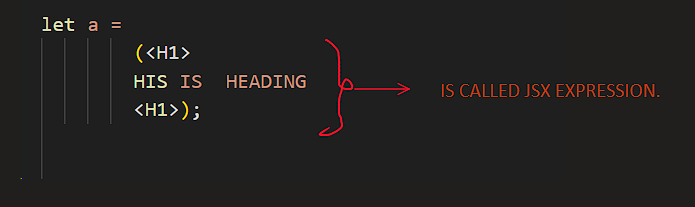

# What is BABEL

**-> In the context of Node.js, React, and Parcel, Babel is a tool used to transform modern JavaScript (ES6/ES7/ESNext) code into backward-compatible versions for older browsers or environments that may not support the latest JavaScript features. It's a JavaScript compiler that makes it possible to use newer syntax and features without worrying about compatibility.**

**-> Babel is a javaScript code / node module.**

**-> To know the specific version of the browser babel uses browserslist.**


# What is POLYFILLS

**-> A polyfill is a piece of code (usually JavaScript) that provides support for features or functionality in environments that don't natively support them. In other words, it’s a way to "fill in the gaps" for missing features in older browsers or JavaScript environments.**

**-> Yes, you can say that Babel can automatically include polyfills, but it requires some configuration to handle this properly. Babel itself primarily focuses on transpiling syntax, not on adding polyfills for missing runtime features. However, by using a Babel preset like @babel/preset-env and the right configuration, Babel can automatically add the polyfills you need based on the target environments you're supporting.**


# SCRIPTS IN package.json file

**-> package.json contain an "script": object inside which we can write our command so that we can execute them faster by short names**

``` Bash
"scripts": {
    "start": "parcel index.html",      
    "build": "parcel build index.html",
    "test": "echo \"Error: no test specified\" && exit 1"
  },

# Now we have to write "npm run start"/ "npm start" for(npx parcel index.html). 
```


# ABOUT HOW TO REMOVE THE console.log() from our REACT APP

*->For this purpose we have to use a "babel plugin" that is "babel-plugin-transform-remove-console".*

*->And then we have to configure the plugin for our system to remove the console.log().*

*->so we have to install the plugin from website and then configure.*

**below is website link for babel plugin -:**

https://www.npmjs.com/package/babel-plugin-transform-remove-console/v/6.1.17

*->.babelrc file is configration file for babel plugins.*


# JSX IN REACT/JAVASCRIPT

**-> JSX stands for JavaScript XML. JSX allows us to write HTML elements in JavaScript and place them in the DOM without any    createElement() and/or appendChild() methods. JSX makes it easier to write and add HTML in React. JSX converts HTML tags into react elements.**

*-> JSX also prevent our code / website from the XSS(Cross Site Scripting) Attacks.*

# Understanding JSX in React

JSX (JavaScript XML) is a syntax extension for JavaScript that allows you to write HTML-like code directly inside your JavaScript files. It is especially used in the React library to describe what the UI should look like.

## Why JSX is Useful

- **Easier to Read & Write:**  
  JSX makes it simpler to create UI components by allowing you to write markup in a syntax that is very similar to HTML. This means you can visualize the structure of your UI directly in your JavaScript code.

- **Combines Logic with Markup:**  
  With JSX, you can embed JavaScript expressions within your markup using curly braces `{}`. This seamless integration makes it easier to create dynamic, data-driven interfaces.
  
  ```jsx
  const name = "Aditya";
  const element = <h1>Hello, {name}!</h1>;


# How and Who does executes the JSX.

**-> JSX=>coverted into => React.createElement() => gives us JS => Object => and then render into => DOM**

***JSX => React.createElement() => JS Object => HTML(DOM)***

*When you place a JSX code in console and try to run it you will get an error that  ("Uncaught SyntaxError: Unexpected token '<'") -> that means your browser does not understand  or did not know about the JSX then who knows about the JSX and who executes it...*

```bash

let a = 
        (<H1>
        HIS IS  HEADING 
        <H1>);


 #ERROR IN CONSOLE IS -: "Uncaught SyntaxError: Unexpected token '<' "
```


**BABEL -> Understands the JSX and read your whole code line by line and then convert the JSX into React.createElement()**



*** -> Babel is a JavaScript compiler that converts modern JavaScript code into a version compatible with all browsers.
    https://babeljs.io/ go here and check more about babel, babel not only convert the new code to old but also does more things...***


# REACT ELEMENT
*A single tag is called a React Element.*

# NOTE
*-> .package-lock.json file of node module is used to keep the track of transitive dependencies.*

*->and .package-lock.json file which we have created keep the record of all the dependencies we have.*


# REACT COMPONENT

*-> There are two types of the React components.-:*

* Class Based Components. -> Old way to write the code.
* Function Based Components. -> New way to write the code. (We will learn the funciton based Components).


# What are the Function Components?
**->In React, a functional component is a simple JavaScript function that returns JSX (JavaScript XML), which represents the UI of the component.**

**->Function Component name must be start from a capital letter.Otherwise React treats them as regular HTML tags instead of custom components.

**


# Composing Components
**-> Passing components in a Component in react is called the Composing Components.**


