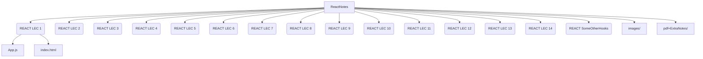

# 🚀 ReactNotes: My Journey with Namaste React by Akshay Saini

---

## 📚 About This Repository

This repository contains all my learnings, code, and notes from the **Namaste React** course by [Akshay Saini](https://namastedev.com/namaste-react).  
Here you'll find hands-on code, theory, and experiments as I explored React and its ecosystem, from the basics to advanced concepts.

---

## 🛠️ Tech Stack Covered

- **React** (Hooks, Class Components, Lifecycle)
- **Redux** (State Management)
- **React Router** (Routing & Navigation)
- **Parcel** & **Vite** (Modern Bundlers)
- **Webpack** (Module Bundler)
- **TailwindCSS** (Utility-first CSS)
- **Babel** (`.babelrc` for JS/JSX transpilation)
- **VS Code** (with recommended extensions)
- **Git & GitHub** (Version Control)

---

## 🗂️ Folder Structure

## ✨ Highlights

- **Comprehensive Notes:** Markdown notes for each lecture, including theory and code.
- **Code Examples:** Real-world React code, from simple components to advanced hooks and Redux.
- **Bundler Demos:** Examples using Parcel, Vite, and Webpack.
- **Styling:** TailwindCSS and custom CSS for modern UIs.

---

## 📦 How to Use

1. **Clone this repo:**  
   `git clone <your-repo-url>`
2. **Open in VS Code**
3. **Install dependencies:**  
   `npm install`
4. **Run locally:**  
   `npm start` or `npm run dev` (depending on the setup)
5. **Explore the folders:**  
   Each folder contains code and notes for different topics.

---
## 🌟 Happy Learning!